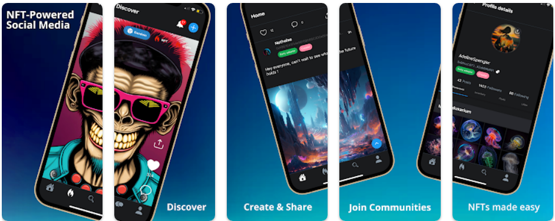
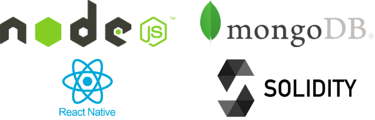
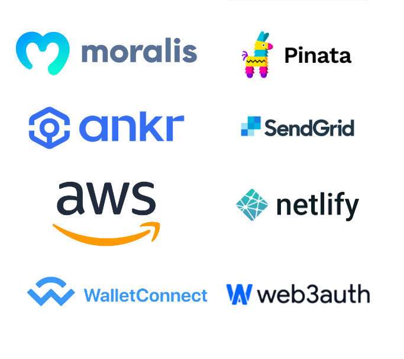
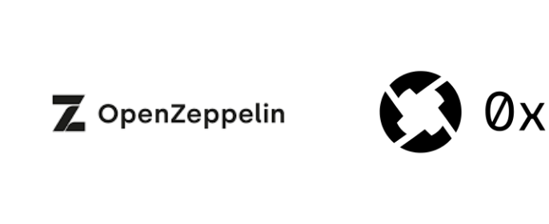
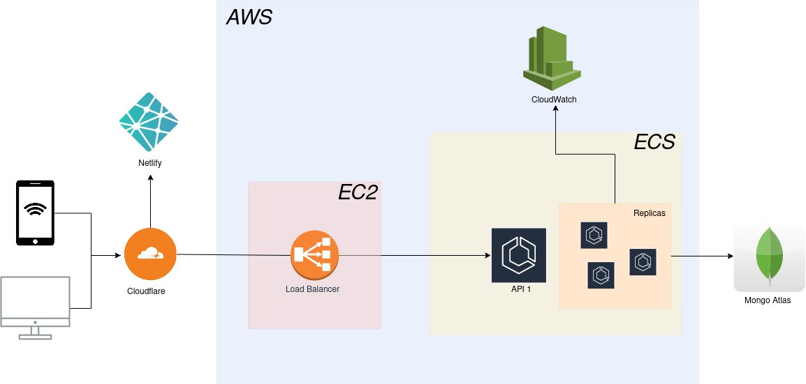

# Nefting 

<details open>
<summary> Global </summary>

### What is ?

<center>

</center>

Nefting is a social network based on Web 3.0 and NFTs. It's a combination of Instagram, Twitter and Opensea, where users can log in with their digital wallet (or by email and we generate a digital wallet for them).

Users can interact with their NFTs using social features (Likes, Posts, Comments and Shares).

It's also possible to trade or sell your NFTs thanks to the showcases, which enable users to put their NFTs up for sale from their profile, or to use the exchange system to trade NFTs for other NFTs.

### Availabilities

|                 | Web Desktop        | Web Mobile | iOS | Android |
|-----------------|--------------------|------------|-----|---------|
| Available       | <center>✅</center> |     <center>✅</center>       |   <center>✅</center>  |     <center>✅</center>    |
| Login           | <center>✅</center> |       <center>✅</center>     |   <center>✅</center>  |    <center>✅</center>     |
| NFT Social      | <center>✅</center>        |     <center>✅</center>       |  <center>✅</center>   |    <center>✅</center>     |
| NFT Interaction | <center>✅</center>        |     <center>✅</center>       |   <center>✅</center>  |    <center>✅</center>     |
| Swap            | <center>✅</center>        |     <center>✅</center>       |  <center>❌</center>   |    <center>❌</center>      |
| Sell            | <center>✅</center>        |     <center>✅</center>       |   <center>❌</center>   |     <center>❌</center>     |

### Chains

Nefting is a multi-chain social media enabling users to interact easily on :

- **[Ethereum](https://ethereum.org/)**
- **[Polygon](https://polygon.technology/)**
- **[Binance Smart Chain](https://www.bnbchain.org/en/smartChain)**

### Technologies

<center>

</center>

Nefting is based on 4 main technologies:

- **[React Native](https://reactnative.dev/)** (WebApp Desktop, WebApp Mobile, iOS, Android)
- **[NodeJS](https://nodejs.org/)** (Database communication interface from a remote server)
- **[MongoDB](https://www.mongodb.com/)** (Database)
- **[Solidity](https://docs.soliditylang.org/en/v0.8.21/)** (Programming language for smart contracts on main EVM chains)

### Services

<center>

</center>

Nefting uses external services to enhance its experience:

- **[Netlify](https://www.netlify.com/)** (Pipeline, automated deployment and WEB redundancy management)
- **[AWS](https://aws.amazon.com/)** (Infrastructure and APIs)
- **[Moralis](https://moralis.io/)** (Aggregation of on-chain and multi-chain NFT data)
- **[Pinata](pinata.cloud)** (Storing NFTs on IPFS and retrieving IPFS content)
- **[Sendgrid](https://sendgrid.com/)** (Send emails when user receives notifications)
- **[ANKR](https://www.ankr.com/)** (On-chains data recovery provider)
- **[WalletConnect](https://walletconnect.com/)** (Digital wallet connection)
- **[Web3Auth](https://web3auth.io/)** (Login and generate a digital wallet by e-mail)


</details>

<details>
<summary> Front </summary>


### Setup project

- Installing NodeJS (16.10)

- ```npm install```
- ```npm start```
- Press "w", "i", "a" for generating and executing web, iOS or Android bundle

### Install EAS

Expo Application Services - Deeply integrated cloud services for Expo and React Native apps, from the team behind Expo.

EAS enables Nefting to build and deploy iOS & Android applications from their pipeline.

EAS also enables tunnel management, making it easier to update an application for a `HOT FIX` without having to go through the stores (AppStore/PlayStore).

- ```npm install -g eas-cli```

### Web Deploy

- ```git push origin main```

### IOS Build

- ```eas build --platform ios```

### Android Build

- ```eas build --platform android```

### IOS Update

- ```eas update --channel $CHANNEL```

### Android Update

- ```eas update --channel $CHANNEL```

</details>

<details>
<summary> Back </summary>

### Setup project

- Installing NodeJS (16.10)

- ```npm install```
- ```npm start```
- Configure .env with API Keys & Mongo URI

### Production deployment

```bash
# On master branch when it's up to date
git tag v1.0.0
git push --tags
```

</details>

<details>
<summary> Smarts Contracts </summary>

<center>

</center>

Nefting uses two technologies to manage smart contracts:

- [OpenZeppelin](https://www.openzeppelin.com/) (Smarts contracts library already audited)
- [0x](https://www.0x.org/) (EVM-Compatible secure and audited library and transfer infrastructure)


### OpenZeppelin

To create NFTs, Nefting has its own smarts contracts that comply with the [ERC1155](https://ethereum.org/fr/developers/docs/standards/tokens/erc-1155/) NFT standard.

The contracts deployed use OpenZeppelin, which provides additional security thanks to its opensource and audited nature.

Here is the list of smarts contracts deployed for Nefting:

|                     | Address | Type    |
|---------------------|---------|---------|
| Ethereum            |    0x33fc85dc3142e894778147bFf71d05b2E3F87Cc9     | ERC1155 |
| Polygon             |    0x33fc85dc3142e894778147bFf71d05b2E3F87Cc9     | ERC1155 |
| Binance Smart Chain |    0xbf885127381f1aff0c7710a7b93bbeab96a8e48a     | ERC1155 |

### 0x

Nefting uses smarts contracts in Solidity to interact with tokens and NFTs.

As a security measure, Nefting also uses audited and secured contracts of [0x](https://www.0x.org/) for transfers / sales of digital assets.

Full integration documentation (V3 for Swaps and V4 for NFT sales from a showcase) [here](https://docs.swapsdk.xyz/).

</details>

<details>
<summary> Cloud Infrastructure </summary>

<center>

</center>

This section describes the Nefting ECS stack.

## Copilot

The project is configured to be deployed with the [AWS Copilot tool](https://aws.github.io/copilot-cli/docs/overview/).

For each env (staging & production for now), the Copilot tool creates a new dedicated VPC and load balancer.
For every single service and for every env, the Copilot tools creates a new CloudFormation stack (nefting-production-api, ...).

The CloudFormation stacks create:
- an auto scaling policy & target
- a load balancer HTTP(S) listener rule
- a CloudWatch log group
- an ECS task definition
- an ECS service

## Install the Copilot tools

Install & configure aws-cli & copilot-cli:

- [aws-cli](https://docs.aws.amazon.com/cli/latest/userguide/cli-chap-install.html)
- [aws config](https://docs.aws.amazon.com/cli/latest/userguide/cli-configure-quickstart.html)
- [copilot-cli](https://aws.github.io/copilot-cli/docs/getting-started/install)
- [copilot config](https://aws.github.io/copilot-cli/docs/credentials/)

If you have many AWS CLI profiles in your `~/.aws/credentials` file:

```bash
export AWS_PROFILE=nefting
```

If everything is well configured, you should see `nefting` when running:

```bash
copilot app show
```

## Create a service

```bash
copilot init
# Choose "Load Balanced Web Service" for public api or "Backend service" for microservices
# Don't deploy to a test env
copilot app init 
# Choose "Use `nefting` application" 
```

Now, configure the `copilot/manifest.yml` file.

If the service is a Load Balanced Web Service, you must set the ELB `path` value, without `/`. e.g.: `hub`.

## Deploy the service

```bash
ENVIRONMENT_NAME=production
SERVICE=nefting-api

copilot svc deploy -e ${ENVIRONMENT_NAME} -n ${SERVICE} --tag "$(git describe --tags --always)-$(date +"%Y%m%d-%H%M%S" -u)"
```

:warning: If you deploy the 2 service at the same time you will get this error
```bash
✘ Proposing infrastructure changes for stack nefting-production-nefting-api
✘ deploy service nefting-api to environment production: deploy service: stack nefting-production-nefting-api is currently being updated and cannot be deployed to
```

In this case :

1. Go on [AWS Console in CloudFormation](https://eu-west-3.console.aws.amazon.com/cloudformation/home?region=eu-west-3#/stacks?filteringText=&filteringStatus=active&viewNested=true)
2. Select nefting-production-nefting-api stack
3. Click on Stack Action then "Cancel stack update"
4. Wait while the stack is not in "CREATE_COMPLETE" state
5. Deploy again

## Configure secrets

```bash
ENVIRONMENT_NAME=production
SECRET_NAME=MONGO_URI.....
SECRET_VALUE=mongo://......

aws ssm put-parameter --name ${SECRET_NAME} --value ${SECRET_VALUE} --type SecureString --tags Key=copilot-environment,Value=${ENVIRONMENT_NAME} Key=copilot-application,Value=nefting
```

</details>